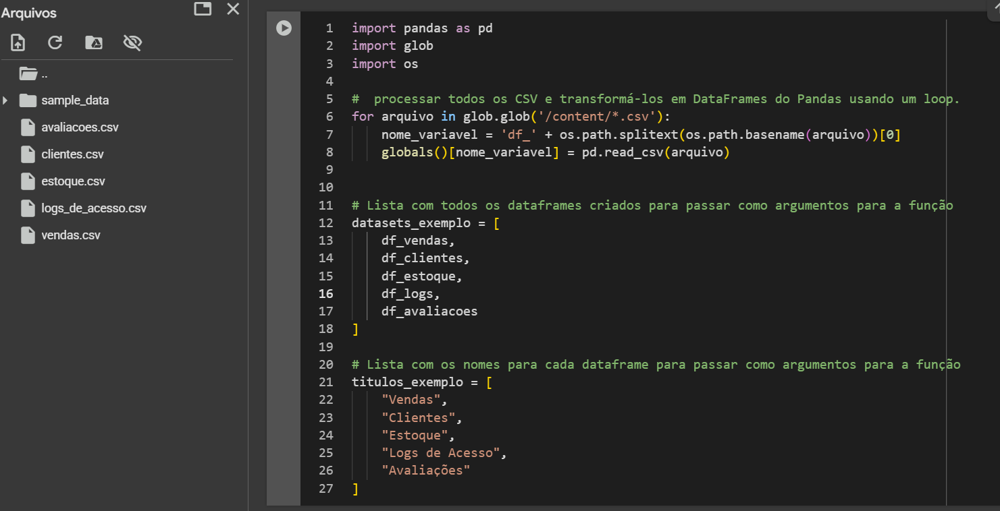
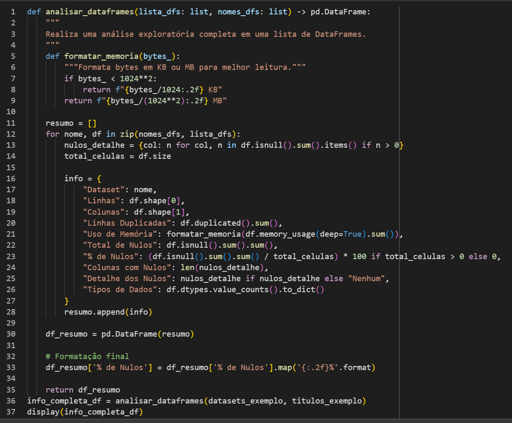
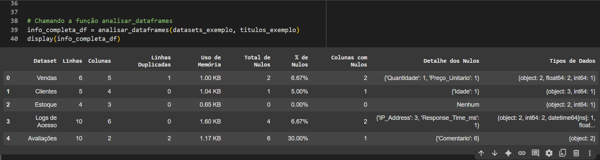
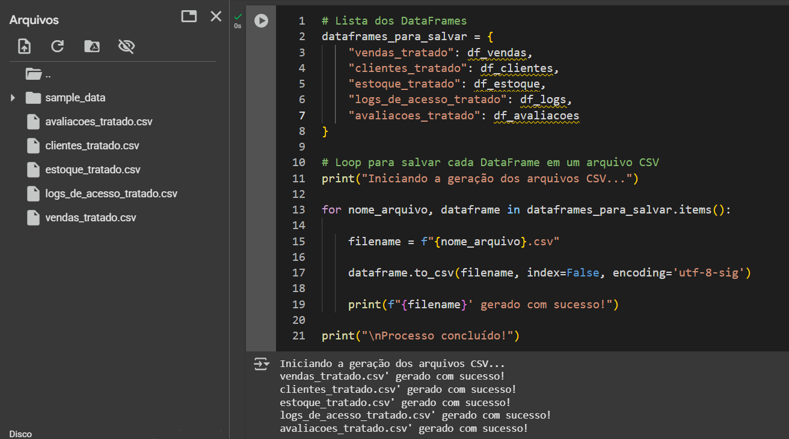

# Scanner de Dados: Um Painel para Análise Inicial Rápida
Um script em Python para automatizar a Análise Exploratória de Dados (EDA) de múltiplos arquivos.
## O Problema

Todo profissional de dados conhece a rotina: ao receber um novo conjunto de dados (muitas vezes dividido em múltiplos arquivos), o primeiro passo é sempre uma **análise exploratória (EDA)** para entender sua estrutura e qualidade.  

Esse processo, embora crucial, pode ser repetitivo e demorado. É preciso verificar:

- **O número de linhas e colunas**
- **A presença de dados duplicados**
- **A quantidade e a localização de valores nulos**
- **Os tipos de dados de cada coluna para identificar inconsistências**
- **O uso de memória, especialmente em datasets grandes**

Fazer isso manualmente para cada arquivo consome um tempo valioso que poderia ser usado em análises mais profundas.

---

## A Solução

Este repositório contém uma função Python **`analisar_dataframes`**, projetada para automatizar e centralizar a etapa inicial de Análise Exploratória de Dados (EDA).  

Ela recebe uma lista de **DataFrames** e gera um **painel de controle consolidado**, permitindo uma visão geral e rápida da “saúde” de todos os seus dados de uma só vez.

---

## Principais Funcionalidades

A função gera um **DataFrame de resumo** com as seguintes informações para cada dataset analisado:

- **Estrutura Básica** — Contagem de linhas e colunas.
- **Dados Duplicados** — Quantidade de linhas completamente duplicadas.
- **Uso de Memória** — Estimativa do consumo de memória (formatado em KB ou MB).
- **Análise de Nulos**  
  - Contagem total de valores nulos.  
  - Percentual sobre o total de células.  
  - Número de colunas afetadas.  
  - Detalhamento por coluna com valores ausentes.
- **Análise de Tipos** — Resumo dos tipos de dados (`dtypes`) presentes, ajudando a identificar colunas com tipos mistos ou incorretos.

---

## Demonstração

A seguir, um exemplo do uso da função **`analisar_dataframes`** e das etapas realizadas.

### 1. Processamento dos Dados
  
  > Neste bloco, o código realiza a preparação inicial do ambiente e o carregamento dos dados a partir de arquivos CSV.

**Importação de Bibliotecas**
```python
import pandas as pd  # Para manipulação e análise de dados
import glob          # Para encontrar arquivos por padrão
import os            # Para interagir com o sistema operacional
```
* `pandas`: Fundamental para manipulação e análise de dados, apelidada de `pd`.
* `glob`: Utilizada para encontrar todos os nomes de arquivos que correspondem a um padrão.
* `os`: Oferece funcionalidades do sistema operacional, como manipulação de caminhos de arquivos.

**Processamento dos Arquivos e Criação dos DataFrames**
* O código utiliza `glob.glob('/content/*.csv')` para criar uma lista com o caminho de todos os arquivos `.csv` no diretório `/content/`.
* Em seguida, um laço `for` percorre cada caminho de arquivo encontrado.
* **Dentro do laço**:
    * `os.path.splitext(os.path.basename(arquivo))[0]` extrai o nome base do arquivo (ex: de `/content/vendas.csv` extrai `vendas`).
    * Uma variável é criada dinamicamente com o prefixo `df_` seguido do nome do arquivo (ex: `df_vendas`).
    * `pd.read_csv(arquivo)` lê o arquivo CSV e o transforma em um DataFrame do Pandas.
    * `globals()[nome_variavel] = ...` atribui o DataFrame recém-criado à variável com o nome dinâmico no escopo global.

**Criação de Listas para a Função**
* `datasets_exemplo`: Uma lista é criada para armazenar todas as variáveis de DataFrame geradas (`df_vendas`, `df_clientes`, etc.).
* `titulos_exemplo`: Uma lista paralela contendo nomes amigáveis para cada DataFrame (`"Vendas"`, `"Clientes"`, etc.).

---

### 2. Definição da Função
  
> Esta imagem mostra a definição de uma função completa em Python, projetada para realizar uma análise exploratória detalhada em uma lista de DataFrames.

**Definição da Função `analisar_dataframes`**
* A função aceita dois argumentos: `lista_dfs` (uma lista de DataFrames) e `nomes_dfs` (uma lista com os nomes correspondentes).
* Ela foi projetada para retornar um único DataFrame do Pandas (`-> pd.DataFrame:`) contendo o resumo da análise.

**Função Auxiliar `formatar_memoria`**
* Dentro da função principal, uma função aninhada `formatar_memoria` é definida.
* Seu objetivo é receber um valor de memória em bytes e convertê-lo para um formato mais legível (KB ou MB).

**Loop Principal de Análise**
* A função itera simultaneamente sobre as listas `nomes_dfs` e `lista_dfs` usando `zip`.
* Para cada `df`, um dicionário `info` é criado para armazenar as seguintes métricas:
    * **Dataset**: O nome do DataFrame.
    * **Linhas e Colunas**: Obtido com `df.shape`.
    * **Linhas Duplicadas**: A contagem de `df.duplicated().sum()`.
    * **Uso de Memória**: Formatado pela função auxiliar.
    * **Total de Nulos**: A soma de `df.isnull().sum().sum()`.
    * **% de Nulos**: A porcentagem de células nulas.
    * **Colunas com Nulos**: O número de colunas com pelo menos um valor nulo.
    * **Detalhe dos Nulos**: Dicionário com a contagem de nulos por coluna.
    * **Tipos de Dados**: A contagem de cada tipo de dado presente nas colunas.
* Ao final de cada iteração, o dicionário `info` é adicionado a uma lista `resumo`.

**Finalização e Retorno**
* `pd.DataFrame(resumo)` converte a lista de dicionários em um único DataFrame consolidado.
* A coluna `'% de Nulos'` é formatada para exibir apenas duas casas decimais.
* Finalmente, a função retorna o `df_resumo` completo.

---


### 3. Execução da Função
  
> Este bloco mostra a chamada da função `analisar_dataframes` e o resultado gerado.

**Chamada da Função**
* A linha `info_completa_df = analisar_dataframes(datasets_exemplo, titulos_exemplo)` executa a função.
* As listas preparadas no primeiro passo são passadas como argumentos.
* O DataFrame resultante é armazenado na variável `info_completa_df`.

**Exibição do Resultado**
* `display(info_completa_df)` exibe o DataFrame de forma formatada (comum em ambientes como Jupyter ou Google Colab).
* A tabela de saída apresenta uma visão geral e comparativa de todos os datasets, permitindo uma avaliação rápida da qualidade e estrutura de cada um.

---

### 4. Salvando o Resultado
  
> Esta imagem final mostra o processo de salvar os DataFrames em novos arquivos CSV.

**Criação de um Dicionário**
* Um dicionário `dataframes_para_salvar` é criado para mapear os nomes dos arquivos de saída para os DataFrames correspondentes.
    * **Chaves**: Nomes dos arquivos a serem criados (ex: `"vendas_tratado"`).
    * **Valores**: As variáveis de DataFrame a serem salvas.

**Loop para Salvar em CSV**
* O código itera sobre os itens do dicionário.
* Em cada iteração, o nome do arquivo é construído (ex: `f"{nome_arquivo}.csv"`).
* O comando `dataframe.to_csv(...)` é usado para salvar o DataFrame em um arquivo CSV, com os seguintes parâmetros:
    * `index=False`: Impede que o índice do DataFrame seja salvo como uma coluna.
    * `encoding='utf-8-sig'`: Garante a codificação correta para suportar caracteres especiais.

**Saída do Terminal**
* A área inferior da imagem mostra a saída do console, confirmando que cada um dos DataFrames foi salvo com sucesso em seu respectivo arquivo `.csv`.

---

### Contribuições e Contato
Se você gostou deste projeto ou tem sugestões, fique à vontade para abrir uma issue ou enviar um pull request!
Também estou disponível para tirar dúvidas e trocar ideias — basta me contatar.

LinkedIn:  [](https://www.linkedin.com/in/wallace-almeida-amaral/)

WhatsApp:  [](https://wa.me/5587999160921)
